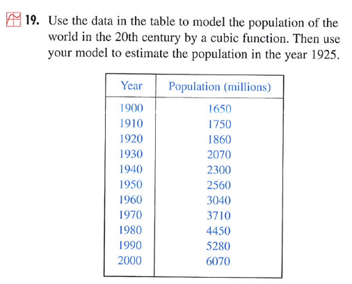

% Introduction to the Workshop
% Daniel T Kaplan

Introduction to the Workshop
========================================================

### Introduce the workshop leaders: Danny and Randy

We'll have you introduce yourselves in a few moments.

### The point of this workshop

* To help you choose a set of functions for teaching calculus
    * Actually, **families of functions** --- we'll be concerned about the parameterization of function types
    * Functions useful for modeling
    * Functions that illustrate calculus concepts well
* To work through some of the issues of "useful for modeling."
* To relate calculus to statistics

#### Example: 

A starting problem: Stewart's cubic population for interpolation (from Stewart Calculus: Concepts and Contexts 2/e p. 38. It appears in Chapter 1)

\ 

Questions about this.

* Is the cubic an appropriate form?
* What's appropriate depends on the purpose: that's what modeling is about
* What should be in the student's toolkit?
* How can we give them a toolkit that they can use elsewhere?  (Modeling a population with a cubic isn't likely to get you very far in understanding population dynamics.)
* Shouldn't students have a means to know if their approximation is good?  
    * Why would you want to use a global function rather than just linear interpolation through the two nearest data points.
    * Students need to have a notions of **stiffness** and a set of possible functions to choose from.

#### Sponsors
* Project MOSAIC
* CAUSE
* MAA
* NSF DUE

#### Review the schedule
* Two sessions in the morning with a 15-minute break in between
* An hour for lunch, provided by Project MOSAIC
* Two sessions in the afternoon with a 15-minute break

#### Broad Outline
* Session One: Choosing functions and parameterizations
* Session Two: Fitting and Calculus operations on functions
* Lunch
* Session Three: Motivation for linear and power-Law functions
* Session Four: Functions of multiple variables
